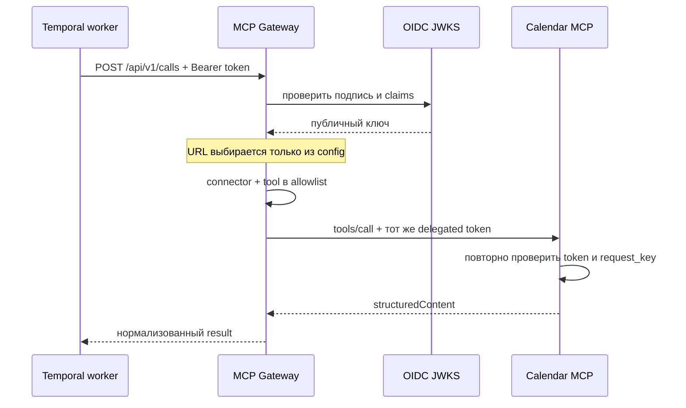

# Архитектура

## Поток вызова



## Папки

```text
controller -> service -> client -> MCP service
     |           |          |
     v           v          v
   HTTP        model    official SDK

config -> OIDC JWKS
```

Gateway stateless: он не хранит action, сессию диалога или результат. Durable retry принадлежит Temporal.
Gateway намеренно не повторяет изменяющий tool после неизвестного сетевого результата. `requestKey`
передаётся как `request_key`, а конечный MCP-сервис обеспечивает идемпотентность.

Текущий MVP использует delegated token. Он должен содержать audience и scope обеих границ. Перед
подключением внешних пользовательских провайдеров добавляется отдельный RFC для OAuth token exchange;
секреты провайдеров не должны проходить через этот API.
