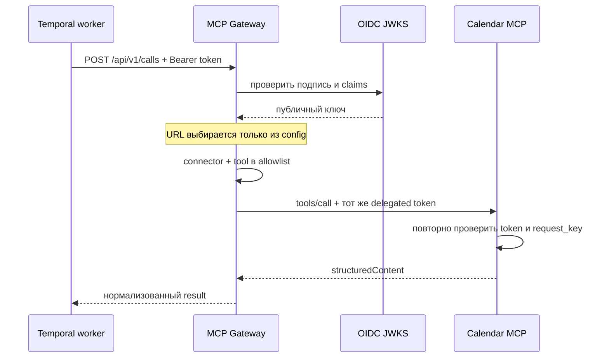

# Архитектура

## Поток вызова


```mermaid
sequenceDiagram
    participant Worker as Temporal worker
    participant Gateway as MCP Gateway
    participant OIDC as OIDC JWKS
    participant MCP as Calendar MCP

    Worker->>Gateway: POST /api/v1/calls + Bearer token
    Gateway->>OIDC: проверить подпись и claims
    OIDC-->>Gateway: публичный ключ
    Note over Gateway: URL выбирается только из config
    Gateway->>Gateway: connector + tool в allowlist
    Gateway->>MCP: tools/call + тот же delegated token
    MCP->>MCP: повторно проверить token и request_key
    MCP-->>Gateway: structuredContent
    Gateway-->>Worker: нормализованный result
```

## Папки

```text
controller -> service -> client -> MCP service
     |           |          |
     v           v          v
   HTTP        model    official SDK

config -> OIDC JWKS
```

Gateway stateless: он не хранит action, сессию диалога или результат. Durable retry принадлежит Temporal.
Gateway намеренно не повторяет изменяющий tool после неизвестного сетевого результата. `requestKey`
передаётся как `request_key`, а конечный MCP-сервис обеспечивает идемпотентность.

`context.actorId` не является аргументом модели. Gateway удаляет `actor_id` и `request_key` из
недоверенного `input`, затем добавляет значения из сохранённого действия. Старые fake-вызовы без
`context` остаются совместимыми; настоящий пользовательский provider обязан требовать `actor_id`.

Текущий MVP использует delegated token. Он должен содержать audience и scope обеих границ. Google
OAuth и refresh token принадлежат отдельному Connection Service по ADR-0015 платформы; секреты
провайдеров не проходят через Gateway.
